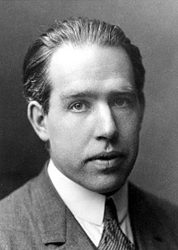

<table class="infobox biography vcard">
<tbody>
<tr>
<th colspan="2">

Niels Bohr

</th>
</tr>
<tr>
<td colspan="2"></td>
</tr>
<tr>
<th scope="row">Born</th>
<td>

Niels Henrik David Bohr

 7 October 1885 

<a title="Copenhagen" href="https://en.wikipedia.org/wiki/Copenhagen">Copenhagen</a>, Denmark

</td>
</tr>
<tr>
<th scope="row">Died</th>
<td>18 November 1962&nbsp;(aged&nbsp;77) 

Copenhagen, Denmark

</td>
</tr>
<tr>
<th scope="row">Resting place</th>
<td class="label"><a title="Assistens Cemetery (Copenhagen)" href="https://en.wikipedia.org/wiki/Assistens_Cemetery_(Copenhagen)">Assistens Cemetery</a></td>
</tr>
<tr>
<th scope="row">Alma&nbsp;mater</th>
<td><a title="University of Copenhagen" href="https://en.wikipedia.org/wiki/University_of_Copenhagen">University of Copenhagen</a></td>
</tr>
<tr>
<th scope="row">Known&nbsp;for</th>
<td>

<a class="mw-collapsible-text">hide</a>

<a href="https://en.wikipedia.org/wiki/Niels_Bohr#Physics">Physics contributions</a>

<ul class="mw-collapsible-content">
<li><a title="Bohr magneton" href="https://en.wikipedia.org/wiki/Bohr_magneton">Bohr magneton</a></li>
<li><a title="Bohr model" href="https://en.wikipedia.org/wiki/Bohr_model">Bohr model</a></li>
<li><a title="Bohr radius" href="https://en.wikipedia.org/wiki/Bohr_radius">Bohr radius</a></li>
<li><a title="Bohr&ndash;Einstein debates" href="https://en.wikipedia.org/wiki/Bohr%E2%80%93Einstein_debates">Bohr&ndash;Einstein debates</a></li>
<li><a title="BKS theory" href="https://en.wikipedia.org/wiki/BKS_theory">Bohr&ndash;Kramers&ndash;Slater theory</a></li>
<li><a title="Bohr&ndash;Van Leeuwen theorem" href="https://en.wikipedia.org/wiki/Bohr%E2%80%93Van_Leeuwen_theorem">Bohr&ndash;Van Leeuwen theorem</a></li>
<li><a title="Old quantum theory" href="https://en.wikipedia.org/wiki/Old_quantum_theory">Bohr&ndash;Sommerfeld theory</a></li>
<li><a title="Complementarity (physics)" href="https://en.wikipedia.org/wiki/Complementarity_(physics)">Complementarity</a></li>
<li><a title="Copenhagen interpretation" href="https://en.wikipedia.org/wiki/Copenhagen_interpretation">Copenhagen interpretation</a></li>
</ul>

</td>
</tr>
<tr>
<th scope="row">Spouse(s)</th>
<td>Margrethe N&oslash;rlund (<abbr title="married">m.</abbr>&nbsp;1912)</td>
</tr>
<tr>
<th scope="row">Children</th>
<td><a title="Aage Bohr" href="https://en.wikipedia.org/wiki/Aage_Bohr">Aage</a>,&nbsp;<a title="Ernest Bohr" href="https://en.wikipedia.org/wiki/Ernest_Bohr">Ernest</a>, four other sons</td>
</tr>
<tr>
<th scope="row">Awards</th>
<td><a title="Nobel Prize in Physics" href="https://en.wikipedia.org/wiki/Nobel_Prize_in_Physics">Nobel Prize in Physics</a>&nbsp;(1922)

<a class="mw-collapsible-text">hide</a>

<a href="https://en.wikipedia.org/wiki/Niels_Bohr#Accolades">more accolades</a>

<ul class="mw-collapsible-content">
<li><a title="Hughes Medal" href="https://en.wikipedia.org/wiki/Hughes_Medal">Hughes Medal</a>&nbsp;(1921)</li>
<li><a title="Matteucci Medal" href="https://en.wikipedia.org/wiki/Matteucci_Medal">Matteucci Medal</a>&nbsp;(1923)</li>
<li><a title="Franklin Medal" href="https://en.wikipedia.org/wiki/Franklin_Medal">Franklin Medal</a>&nbsp;(1926)</li>
<li><a title="Royal Society" href="https://en.wikipedia.org/wiki/Royal_Society">Foreign Member of the Royal&nbsp;Society</a>&nbsp;(1926)</li>
<li><a title="Max Planck Medal" href="https://en.wikipedia.org/wiki/Max_Planck_Medal">Max Planck Medal</a>&nbsp;(1930)</li>
<li><a title="Faraday Lectureship Prize" href="https://en.wikipedia.org/wiki/Faraday_Lectureship_Prize">Faraday Lectureship Prize</a>&nbsp;(1930)</li>
<li><a title="Copley Medal" href="https://en.wikipedia.org/wiki/Copley_Medal">Copley Medal</a>&nbsp;(1938)</li>
<li><a title="Order of the Elephant" href="https://en.wikipedia.org/wiki/Order_of_the_Elephant">Order of the&nbsp;Elephant</a>&nbsp;(1947)</li>
<li><a title="Atoms for Peace Award" href="https://en.wikipedia.org/wiki/Atoms_for_Peace_Award">Atoms for Peace Award</a>&nbsp;(1957)</li>
<li><a title="Sonning Prize" href="https://en.wikipedia.org/wiki/Sonning_Prize">Sonning Prize</a>&nbsp;(1957)</li>
</ul>

</td>
</tr>
<tr>
<td colspan="2"><strong>Scientific career</strong></td>
</tr>
<tr>
<th scope="row">Fields</th>
<td class="category"><a title="Theoretical physics" href="https://en.wikipedia.org/wiki/Theoretical_physics">Theoretical physics</a></td>
</tr>
<tr>
<th scope="row">Institutions</th>
<td>

<ul>
<li><a title="Trinity College, Cambridge" href="https://en.wikipedia.org/wiki/Trinity_College,_Cambridge">Trinity College, Cambridge</a></li>
<li><a title="University of Copenhagen" href="https://en.wikipedia.org/wiki/University_of_Copenhagen">University of Copenhagen</a></li>
<li><a title="Victoria University of Manchester" href="https://en.wikipedia.org/wiki/Victoria_University_of_Manchester">Victoria University of Manchester</a></li>
</ul>

</td>
</tr>
<tr>
<th scope="row"><a title="Thesis" href="https://en.wikipedia.org/wiki/Thesis">Thesis</a></th>
<td><a class="external text" href="https://doi.org/10.1016/S1876-0503(08)70015-X" rel="nofollow"><em>Studies on the Electron Theory of Metals</em></a>&nbsp;(1911)</td>
</tr>
<tr>
<th scope="row"><a title="Doctoral advisor" href="https://en.wikipedia.org/wiki/Doctoral_advisor">Doctoral advisor</a></th>
<td><a title="Christian Christiansen" href="https://en.wikipedia.org/wiki/Christian_Christiansen">Christian Christiansen</a></td>
</tr>
<tr>
<th scope="row">Other&nbsp;academic advisors</th>
<td>

<ul>
<li><a title="J. J. Thomson" href="https://en.wikipedia.org/wiki/J._J._Thomson">J. J. Thomson</a></li>
<li><a title="Ernest Rutherford" href="https://en.wikipedia.org/wiki/Ernest_Rutherford">Ernest Rutherford</a></li>
</ul>

</td>
</tr>
<tr>
<th scope="row">Doctoral students</th>
<td><a class="mw-redirect" title="Hendrik Kramers" href="https://en.wikipedia.org/wiki/Hendrik_Kramers">Hendrik Kramers</a> <a title="Ishrat Hussain Usmani" href="https://en.wikipedia.org/wiki/Ishrat_Hussain_Usmani">I. H. Usmani</a></td>
</tr>
<tr>
<th scope="row">Other&nbsp;notable students</th>
<td><a title="Lev Landau" href="https://en.wikipedia.org/wiki/Lev_Landau">Lev Landau</a></td>
</tr>
<tr>
<th scope="row">Influences</th>
<td>

<ul>
<li><a title="Ernest Rutherford" href="https://en.wikipedia.org/wiki/Ernest_Rutherford">Ernest Rutherford</a></li>
<li><a title="Harald H&oslash;ffding" href="https://en.wikipedia.org/wiki/Harald_H%C3%B8ffding">Harald H&oslash;ffding</a></li>
</ul>

</td>
</tr>
<tr>
<th scope="row">Influenced</th>
<td>

<ul>
<li><a title="Werner Heisenberg" href="https://en.wikipedia.org/wiki/Werner_Heisenberg">Werner Heisenberg</a></li>
<li><a title="Wolfgang Pauli" href="https://en.wikipedia.org/wiki/Wolfgang_Pauli">Wolfgang Pauli</a></li>
<li><a title="Paul Dirac" href="https://en.wikipedia.org/wiki/Paul_Dirac">Paul Dirac</a></li>
<li><a title="Lise Meitner" href="https://en.wikipedia.org/wiki/Lise_Meitner">Lise Meitner</a></li>
<li><a title="Max Delbr&uuml;ck" href="https://en.wikipedia.org/wiki/Max_Delbr%C3%BCck">Max Delbr&uuml;ck</a></li>
<li><a title="Karen Barad" href="https://en.wikipedia.org/wiki/Karen_Barad">Karen Barad</a></li>
</ul>

</td>
</tr>
<tr>
<th colspan="2">Signature</th>
</tr>
<tr>
<td colspan="2"></td>
</tr>
</tbody>
</table>
 

<strong>Niels Henrik David Bohr</strong>&nbsp;(7 October 1885&nbsp;&ndash; 18 November 1962) was a Danish&nbsp;<a title="Physicist" href="https://en.wikipedia.org/wiki/Physicist">physicist</a>&nbsp;who made foundational contributions to understanding&nbsp;<a class="mw-redirect" title="Atomic structure" href="https://en.wikipedia.org/wiki/Atomic_structure">atomic structure</a>&nbsp;and&nbsp;<a title="Old quantum theory" href="https://en.wikipedia.org/wiki/Old_quantum_theory">quantum theory</a>, for which he received the&nbsp;<a title="Nobel Prize in Physics" href="https://en.wikipedia.org/wiki/Nobel_Prize_in_Physics">Nobel Prize in Physics</a>&nbsp;in 1922. Bohr was also a&nbsp;<a title="Philosopher" href="https://en.wikipedia.org/wiki/Philosopher">philosopher</a>&nbsp;and a promoter of scientific research.

Bohr developed the&nbsp;<a title="Bohr model" href="https://en.wikipedia.org/wiki/Bohr_model">Bohr model</a>&nbsp;of the&nbsp;<a title="Atom" href="https://en.wikipedia.org/wiki/Atom">atom</a>, in which he proposed that energy levels of&nbsp;<a title="Electron" href="https://en.wikipedia.org/wiki/Electron">electrons</a>&nbsp;are discrete and that the electrons revolve in stable orbits around the&nbsp;<a title="Atomic nucleus" href="https://en.wikipedia.org/wiki/Atomic_nucleus">atomic nucleus</a>&nbsp;but can jump from one energy level (or orbit) to another. Although the Bohr model has been supplanted by other models, its underlying principles remain valid. He conceived the principle of&nbsp;<a title="Complementarity (physics)" href="https://en.wikipedia.org/wiki/Complementarity_(physics)">complementarity</a>: that items could be separately analysed in terms of contradictory properties, like behaving as a&nbsp;<a title="Wave&ndash;particle duality" href="https://en.wikipedia.org/wiki/Wave%E2%80%93particle_duality">wave or a stream of particles</a>. The notion of complementarity dominated Bohr's thinking in both science and philosophy.

Bohr founded the Institute of Theoretical Physics at the&nbsp;<a title="University of Copenhagen" href="https://en.wikipedia.org/wiki/University_of_Copenhagen">University of Copenhagen</a>, now known as the&nbsp;<a title="Niels Bohr Institute" href="https://en.wikipedia.org/wiki/Niels_Bohr_Institute">Niels Bohr Institute</a>, which opened in 1920. Bohr mentored and collaborated with physicists including&nbsp;<a title="Hans Kramers" href="https://en.wikipedia.org/wiki/Hans_Kramers">Hans Kramers</a>,&nbsp;<a title="Oskar Klein" href="https://en.wikipedia.org/wiki/Oskar_Klein">Oskar Klein</a>,&nbsp;<a title="George de Hevesy" href="https://en.wikipedia.org/wiki/George_de_Hevesy">George de Hevesy</a>, and&nbsp;<a title="Werner Heisenberg" href="https://en.wikipedia.org/wiki/Werner_Heisenberg">Werner Heisenberg</a>. He predicted the existence of a new&nbsp;<a title="Zirconium" href="https://en.wikipedia.org/wiki/Zirconium">zirconium</a>-like element, which was named&nbsp;<a title="Hafnium" href="https://en.wikipedia.org/wiki/Hafnium">hafnium</a>, after the Latin name for Copenhagen, where it was discovered. Later, the element&nbsp;<a title="Bohrium" href="https://en.wikipedia.org/wiki/Bohrium">bohrium</a>&nbsp;was named after him.

During the 1930s Bohr helped refugees from&nbsp;<a title="Nazism" href="https://en.wikipedia.org/wiki/Nazism">Nazism</a>. After&nbsp;<a title="German invasion of Denmark (1940)" href="https://en.wikipedia.org/wiki/German_invasion_of_Denmark_(1940)">Denmark was occupied by the Germans</a>, he had a famous meeting with Heisenberg, who had become the head of the&nbsp;<a class="mw-redirect" title="German nuclear weapon project" href="https://en.wikipedia.org/wiki/German_nuclear_weapon_project">German nuclear weapon project</a>. In September 1943 word reached Bohr that he was about to be arrested by the Germans, and he fled to Sweden. From there, he was flown to Britain, where he joined the British&nbsp;<a title="Tube Alloys" href="https://en.wikipedia.org/wiki/Tube_Alloys">Tube Alloys</a>&nbsp;nuclear weapons project, and was part of the British mission to the&nbsp;<a title="Manhattan Project" href="https://en.wikipedia.org/wiki/Manhattan_Project">Manhattan Project</a>. After the war, Bohr called for international cooperation on nuclear energy. He was involved with the establishment of&nbsp;<a title="CERN" href="https://en.wikipedia.org/wiki/CERN">CERN</a>&nbsp;and the&nbsp;<a title="Ris&oslash; DTU National Laboratory for Sustainable Energy" href="https://en.wikipedia.org/wiki/Ris%C3%B8_DTU_National_Laboratory_for_Sustainable_Energy">Research Establishment Ris&oslash; of the Danish Atomic Energy Commission</a>&nbsp;and became the first chairman of the&nbsp;<a title="Nordic Institute for Theoretical Physics" href="https://en.wikipedia.org/wiki/Nordic_Institute_for_Theoretical_Physics">Nordic Institute for Theoretical Physics</a>&nbsp;in 1957.

 

<strong> Publications: </strong>

<ul>

 <li><a target="_blank" href="https://github.com/manjunath5496/Niels-Bohr-Publications/blob/master/tst(13).pdf" style="text-decoration:none;">The Theory of Spectra and Atomic Constitution</a></li>
                            
 <li><a target="_blank" href="https://github.com/manjunath5496/Niels-Bohr-Publications/blob/master/tst(14).pdf" style="text-decoration:none;">Atomic Physics and Human Knowledge</a></li>
 <li><a target="_blank" href="https://github.com/manjunath5496/Niels-Bohr-Publications/blob/master/tst(213).pdf" style="text-decoration:none;">The structure of the atom [Nobel Lecture]</a></li>   
  
 <li><a target="_blank" href="https://github.com/manjunath5496/Niels-Bohr-Publications/blob/main/b(1).pdf" style="text-decoration:none;">Can Quantum-Mechanical Description of Physical Reality be Considered Complete?</a></li>

 <li><a target="_blank" href="https://github.com/manjunath5496/Niels-Bohr-Publications/blob/main/b(2).pdf" style="text-decoration:none;">The Mechanism of Nuclear Fission</a></li>

<li><a target="_blank" href="https://github.com/manjunath5496/Niels-Bohr-Publications/blob/main/b(3).pdf" style="text-decoration:none;">On the Constitution of Atoms and Molecules</a></li>
 <li><a target="_blank" href="https://github.com/manjunath5496/Niels-Bohr-Publications/blob/main/b(4).pdf" style="text-decoration:none;">The Quantum Postulate and the Recent Development of Atomic Theory</a></li>                              
<li><a target="_blank" href="https://github.com/manjunath5496/Niels-Bohr-Publications/blob/main/b(5).pdf" style="text-decoration:none;">Neutron Capture and Nuclear Constitution</a></li>
<li><a target="_blank" href="https://github.com/manjunath5496/Niels-Bohr-Publications/blob/main/b(6).pdf" style="text-decoration:none;">Discussions with Einstein
on Epistemological Problems in Atomic Physics</a></li>
 <li><a target="_blank" href="https://github.com/manjunath5496/Niels-Bohr-Publications/blob/main/b(7).pdf" style="text-decoration:none;">On the Notions of Causality and Complementarity</a></li>

 <li><a target="_blank" href="https://github.com/manjunath5496/Niels-Bohr-Publications/blob/main/b(8).pdf" style="text-decoration:none;"> Velocity-range relation for fission fragments </a></li>
   <li><a target="_blank" href="https://github.com/manjunath5496/Niels-Bohr-Publications/blob/main/b(9).pdf" style="text-decoration:none;">Electron Capture and Loss by Heavy Ions Penetrating through Matter</a></li>
  
   
 <li><a target="_blank" href="https://github.com/manjunath5496/Niels-Bohr-Publications/blob/main/b(10).pdf" style="text-decoration:none;">Quantum Mechanics and Physical Reality</a></li>                              
<li><a target="_blank" href="https://github.com/manjunath5496/Niels-Bohr-Publications/blob/main/b(11).pdf" style="text-decoration:none;">Determination of the surface-tension of water by the method of jet vibration</a></li>
<li><a target="_blank" href="https://github.com/manjunath5496/Niels-Bohr-Publications/blob/main/b(12).pdf" style="text-decoration:none;">The Penetration of Atomic Particles Through Matter</a></li>
<li><a target="_blank" href="https://github.com/manjunath5496/Niels-Bohr-Publications/blob/main/b(13).pdf" style="text-decoration:none;">Natural Philosophy and Human Cultures</a></li>

<li><a target="_blank" href="https://github.com/manjunath5496/Niels-Bohr-Publications/blob/main/b(14).pdf" style="text-decoration:none;">Disintegration of Heavy Nuclei</a></li>
                              
<li><a target="_blank" href="https://github.com/manjunath5496/Niels-Bohr-Publications/blob/main/b(15).pdf" style="text-decoration:none;">Transmutations of Atomic Nuclei</a></li>
                         
</ul>

 
